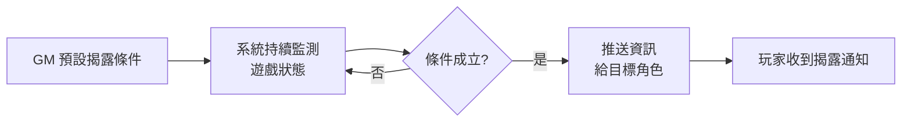

2026.05

Self Introduction

邱庭瑋  ·  Wayne Chiu

<!--
Slide 01 — 標題卡（🅱️ 不對稱角落定錨）
時長：~10s
-->

---
layout: intro-image
image: /photos/cover-hero.jpg
---

# 邱庭瑋  Wayne Chiu

Frontend Engineer

在不斷變化的軟體環境中摸索前行

<!--
Slide 02 — 自我介紹
時長：~20s
記得：補上 slogan
-->

---
layout: intro-image
image: /photos/divider-roots.jpg
---

# 從企劃、測試、再到前端

## 跨越十年的軌跡

<!--
Slide 03 — Part 2 章節標題
時長：~15s
-->

---

<IdentityCard
  number="1"
  role="Game Planner"
  period="2014 – 2016"
  company="卡坦科技 + 遊戲怪獸"
  lesson="使用者思維 與 產品運營"
  bridge="為 feature 與 bug 的優先級判斷打下良好基礎。"
  accent="var(--accent-game)"
/>

<!--
Slide 04 — 身份 1：遊戲企劃
時長：~60s
-->

---

<IdentityCard
  number="2"
  role="QA Engineer"
  period="2016 – 2021"
  company="捷思達數位 · 4 年 7 個月"
  lesson="品質意識 與 系統性思考"
  bridge="測試是我進入軟體業的敲門磚，也磨出了我對品質與系統性問題的直覺。"
  accent="var(--accent-test)"
/>

<!--
Slide 05 — 身份 2：測試工程師
時長：~75s
-->

---

<IdentityCard
  number="3"
  role="Frontend Engineer"
  period="2021 – 現在"
  company="聯合報 + ViewSonic"
  lesson="掌握新知、將想法落地"
  bridge="從小專案到 AI 驅動開發，累積的 know-how 讓我把想做的產品逐步實現。"
  accent="var(--accent-front)"
/>

<!--
Slide 06 — 身份 3：前端工程師
時長：~60s
-->

---
layout: intro-image
image: /photos/divider-craft.jpg
---

# 作品集

## Featured Works

── 工作與興趣的結晶

<!--
Slide 07 — Part 3 章節標題
時長：~15s
-->

---
layout: center
---

# ViewSonic 優派國際

## Frontend Developer · 2024.01 – 2026.02 · 2 年 2 個月

  <a href="/images/classswift.webp" target="_blank" class="text-center hover:opacity-80 transition-opacity">
    
    
ClassSwift · 點圖看原圖

  </a>
  <a href="/images/mvp-chat.png" target="_blank" class="text-center hover:opacity-80 transition-opacity">
    
    
聊天式互動作答 (MVP) · 點圖看原圖

  </a>

### 三個工作軸線：

- **AI 創新小組：PoC / MVP**
  聊天式互動作答 · 學習歷程追蹤
- **上線產品開發與維護**
  Quiz Generator & ClassSwift (Mac)
- **OpenSpec 流程導入**

<!--
Slide 08 — ViewSonic 概覽
時長：~45s
-->

---
layout: center
---

<ProjectAxis
  company="ViewSonic"
  axisLabel="軸線 1 / AI 創新小組"
  image="/images/mvp-chat.png"
  imageCaption="聊天式互動作答 MVP"
  heading="Key Feature："
  :bullets="[
    '聊天式互動作答系統',
    '學習歷程追蹤 & 學生狀態安全警示',
    '作答回饋報告整合'
  ]"
  footerLabel="產品目標："
  footerText="把 LLM 推論結果做成即時、可用的互動介面，提供學生一個安全的 AI 對話環境。"
/>

<!--
Slide 09 — ViewSonic 軸線 1：AI 創新小組 ⭐
時長：~50s
-->

---
layout: center
---

<ProjectAxis
  company="ViewSonic"
  axisLabel="軸線 2 / ClassSwift"
  image="/images/classswift.webp"
  imageCaption="ClassSwift"
  heading="關於 ClassSwift："
  :bullets="[
    'ViewSonic 主力教育產品 · 課堂即時互動',
    '主要負責：Electron Mac 端的開發與迭代'
  ]"
  footerLabel="Stack:"
  footerText="Electron · TypeScript · Redux · Zod · Axios · husky · Vitest"
/>

<!--
Slide 10 — ViewSonic 軸線 2：ClassSwift
時長：~40s
-->

---
layout: center
---

<ProjectAxis
  company="ViewSonic"
  axisLabel="軸線 3 / OpenSpec"
  heading="問題 → 做法 → 結果："
  :bullets="[
    '問題：既有專案要怎麼跟 AI 開發工具整合？',
    '做法：導入 OpenSpec — 為 AI 而生的 Spec-Driven Development',
    '結果：團隊建立能應用於 AI 的開發方式，降低技術債、提升程式碼一致性'
  ]"
/>

<!--
Slide 11 — ViewSonic 軸線 3：OpenSpec
時長：~40s
-->

---
layout: center
---

# LARP Nexus

## 個人專案 · 即時多人 LARP 劇本管理平台

  <a href="https://github.com/KoujiY/larp-nexus" target="_blank" class="text-blue-600 hover:underline">
    GitHub: github.com/KoujiY/larp-nexus
  </a>
  <a href="https://larp-nexus.vercel.app/" target="_blank" class="text-blue-600 hover:underline">
    Demo: larp-nexus.vercel.app
  </a>

  <a href="/images/larp-gm-desktop.png" target="_blank" class="text-center hover:opacity-80 transition-opacity">
    
    
GM 桌面端 · 點圖看原圖

  </a>
  <a href="/images/larp-player-mobile.png" target="_blank" class="text-center hover:opacity-80 transition-opacity">
    
    
玩家手機端 · 點圖看原圖

  </a>

### 兩個子主題：

- **核心概念：**
  即時狀態同步 · 自動揭露引擎 · Runtime / Baseline 切換
- **AI 開發實踐：**
  Claude Code (程式) + Stitch (UI)

<!--
Slide 12 — LARP Nexus 概覽
時長：~45s
-->

---
layout: center
---

<ProjectAxis
  company="LARP Nexus"
  axisLabel="核心概念"
  heading="關鍵功能："
  :bullets="[
    '多角色即時狀態同步 (Pusher WebSocket)',
    '自動揭露引擎 — 依條件向特定玩家自動釋出資訊',
    'Runtime / Baseline 環境切換 — 劇本進行中 vs. 設計階段',
    '原子化知識庫 — 規則拆成小單位、供 AI 查詢'
  ]"
  footerLabel="Stack:"
  footerText="Next.js (App Router · Server Actions) · TypeScript · MongoDB · Tailwind · Pusher"
/>

  <Link to="23" class="hover:text-blue-600 hover:underline">→ 詳見附錄 A2：自動揭露引擎流程圖</Link>

<!--
Slide 13 — LARP Nexus 技術核心
時長：~55s
-->

---
layout: center
---

<ProjectAxis
  company="LARP Nexus"
  axisLabel="AI 開發實踐"
  heading="全程 AI 工具開發："
  :bullets="[
    '程式面：Claude Code',
    'UI/UX：Stitch',
    '知識管理：原子化知識庫',
    '品質：Vitest + Playwright'
  ]"
  footerLabel="心得："
  footerText="AI 浪潮勢不可擋，推陳出新速度只會更驚人。我能做的就是持續跟上、持續驗證。"
/>

<!--
Slide 14 — LARP Nexus AI 開發實踐
時長：~50s
-->

---
layout: center
---

# 聯合報

## 前端工程師 · 2021.10 – 2023.10

  <a href="https://vip.udn.com/newmedia/2022/exoticpets/" target="_blank" class="text-center hover:opacity-80 transition-opacity">
    
    
失控寵物島 · 點圖看專題

  </a>
  <a href="https://vip.udn.com/newmedia/2022/youth_crime/story" target="_blank" class="text-center hover:opacity-80 transition-opacity">
    
    
6名中途少年的觸法自白 · 點圖看專題

  </a>

### 兩個工作軸線：

- **跨專案共用元件庫：**
  NPM 版本控管 · 跨多個專案共用 · 大幅降低重複代碼
- **新聞專題 + GTM：**
  Vite + SPA · Nuxt + SSR · GTM 數據追蹤

<!--
Slide 15 — 聯合報概覽
時長：~30s
-->

---
layout: center
---

<ProjectAxis
  company="聯合報"
  axisLabel="軸線 1 / 跨專案共用元件庫"
  heading="做法 + 影響："
  :bullets="[
    'NPM 版本控管',
    '跨多個專案共用',
    '大幅降低重複代碼',
    '提升跨專案開發效率'
  ]"
  footerLabel="收穫："
  footerText="養成設計可重用、可維護工具的思考方式。"
/>

<!--
Slide 16 — 聯合報軸線 1：跨專案共用元件庫
時長：~30s
-->

---
layout: center
---

<ProjectAxis
  company="聯合報"
  axisLabel="軸線 2 / 新聞專題 + GTM"
  heading="按需選擇技術："
  :bullets="[
    'Vite + SPA — 新聞專題頁面',
    'Nuxt + SSR — 需要 SEO 的場合',
    'GTM (Google Tag Manager) 數據追蹤'
  ]"
  footerLabel="規模 + 協作："
  footerText="8+ 個專題從 0 到 1 上線；與記者 (PM)、設計師、行銷等跨部門合作。"
/>

<!--
Slide 17 — 聯合報軸線 2：新聞專題 + GTM
時長：~30s
-->

---
layout: intro-image
image: /photos/divider-horizon.jpg
---

# 為什麼是現在

## 為什麼是這裡

What's Next

<!--
Slide 18 — 下一步章節標題
時長：~10s
-->

---
layout: center
class: text-center
---

### 2026 年初

ViewSonic Mac team 因公司戰略調整收掉。

對我來說,這是個正好的時機點

重新思考下一站要做什麼。

<!--
Slide 19 — 離職背景
時長：~25s
-->

---
layout: center
---

# 我想找的下一站

- 跟得上 AI 浪潮、願意一起進化的團隊
- 能讓我繼續深化「AI + 前端整合」的環境
- 願意接觸更廣的軟體 stack,不限於前端

→ 我能帶來的：
&nbsp;&nbsp;&nbsp;做產品的視角 · 品質意識 · AI 開發實踐

<!--
Slide 20 — 想做的事
時長：~50s
-->

---
layout: intro-image
image: /photos/closing-thanks.jpg
---

# Thank you

## 謝謝聆聽

邱庭瑋  Wayne Chiu

📧  TODO: email　·　💼  TODO: linkedin　·　🐙  TODO: github

TODO: QR code for portfolio

<!--
Slide 21 — Thank You + 聯絡資訊
時長：~30s
-->

---
hideInToc: true
layout: center
---

# 附錄 / 詳細經歷時間軸

  

    
2007 – 2012

    
國立成功大學 / 資源工程學系

  

  

    
2012 – 2014

    
當兵 + 重考研究所

  

  

    
2014.8 – 10

    
卡坦科技 / 遊戲企劃

  

  

    
2015.2 – 2016.5

    
遊戲怪獸 / 遊戲企劃

  

  

    
2016.7 – 2021.2

    
捷思達數位 / 測試工程師

  

  

    
2021.2 – 7

    
資策會前端課程

  

  

    
2021.10 – 2023.10

    
聯合報 / 前端工程師

  

  

    
2024.1 – 2026.2

    
ViewSonic / Frontend Developer

  

<!--
Slide A1 — 詳細工作經歷時間軸（Q&A 備用）
-->

---
hideInToc: true
layout: center
---

# 附錄 / 技術範例

## LARP Nexus — 自動揭露引擎

**問題：**
GM 在劇本進行中，需要根據條件自動向特定角色揭露資訊。

**我的設計：**

**使用技術：**
Server Actions · WebSocket 廣播

<!--
Slide A2 — 技術深度範例（Q&A 備用）
-->

---
hideInToc: true
layout: image-right
image: /photos/appendix-hobby.jpg
---

# 附錄 / 個人興趣

## LARP (Live Action Role-Playing)

這個興趣訓練我：

- **系統思維**　　　(規則設計)
- **使用者同理心**　(玩家體驗)
- **即興反應能力**　(現場狀況)

→ 這也是 LARP Nexus 的起點。

<!--
Slide A3 — 個人興趣（Q&A 備用）
-->
